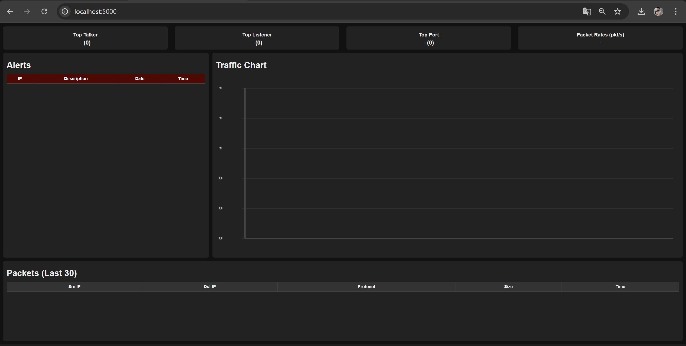
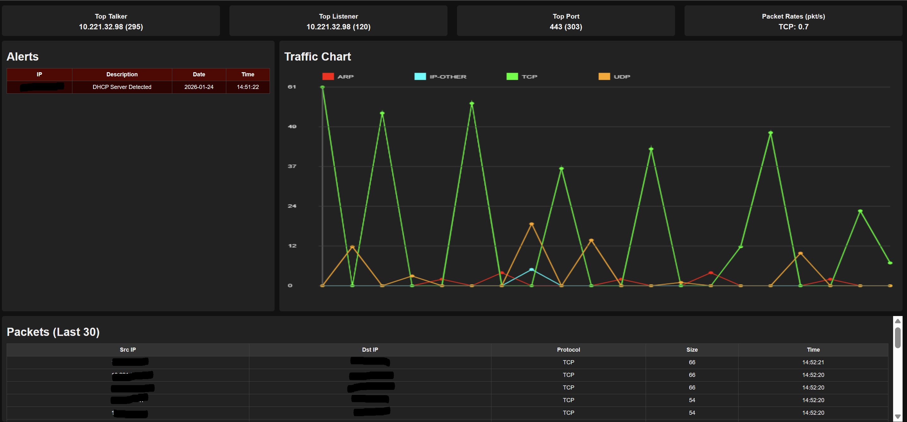
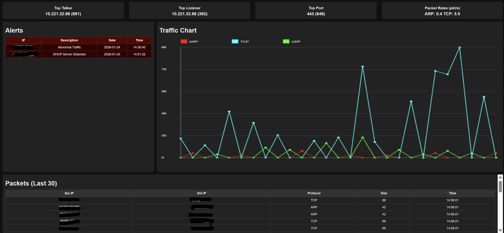
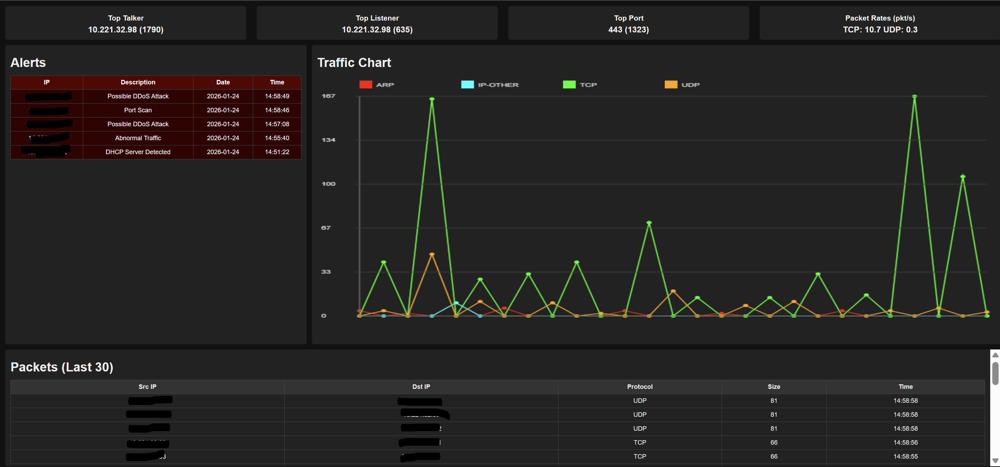
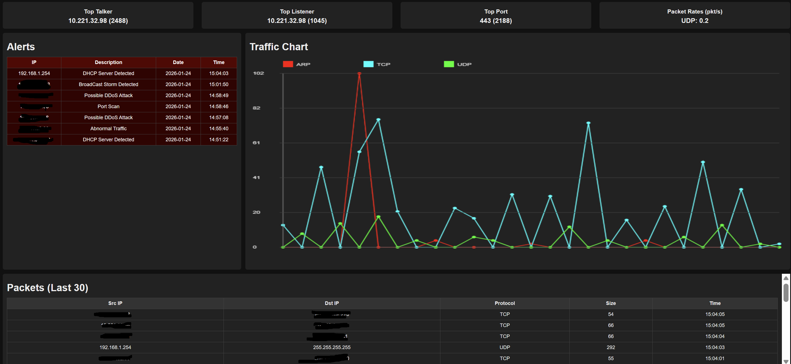

# NIDS (Network Intrusion Detection System)


This project is a **Python-based**  and **multithreading** , built using **Scapy** and **SQLite**. It captures live network traffic from network interface, stores packet information then analyzes traffic patterns in real time, and detects several common network attacks.
<br />
---

## suspicious activities‌:

This project is capable of detecting the following common network attacks :
### 1. Port Scan Detection
Detects when a single source IP contacts many different destination ports within a short time window.

### 2. Abnormal Traffic Detection
Triggers when a host sends an unusually high number of packets in a short period.

### 3. DDoS Detection
Detects a large number of packets targeting the same destination IP.

### 4. DHCP Server Detection
Detects DHCP OFFER/ACK packets (UDP source port 67).

### 5. Broadcast Storm Detection
Detects excessive broadcast traffic (e.g., ARP or IP packets to 255.255.255.255).

### 6. DHCP Starvation Detection
Detects excessive DHCP requests (UDP destination port 67) within a time window.

Detected attacks are stored in a SQLite database for making alerts later.
### Thresholds can be tuned inside `sniffer.py`.
<br />
<br />

## Project Architecture

sniffer.py uses a **producer–consumer architecture** with three main threads:

1. **Sniffing Thread**
   Captures live packets from the network using Scapy.

2. **Saving Thread**
   Stores packet metadata and traffic statistics into a SQLite database.

3. **Analysis Thread**
   Analyzes packets in real time and triggers alerts when suspicious behavior is detected.<br /><br />
---
<br />

## How to run ?

1. Install dependencies:
```bash
pip install scapy
python sniffer.py
```
2. run the files :

```python
at first you should run DataBase.py to make tables!
then you should run sniffer.py, it start to capture, save, and analyze data.
to open the dashboard, run app.py
```
3. in the end, go to **localhost:5000** and Done!

# Now you should see thid screen :
<br />


<br /><br />
---
<br /><br />
# after you start sniffing it gets like this :
<br />
<br /><br />
---
<br /><br /># when it detect abnormal traffic it will show it in alert table, you can see the chart that the valume of packets getting more during the attack :
<br />
<br /><br />
---
<br /><br /># detecting port scan, it also detect possible ddos attack because destination ip was fixed :
<br />
<br /><br />
---
<br /><br /># detecting broadcast storm, also you can see the chart that show the number of packets :
<br />
<br /><br />
---
<br /><br /># detecting fake DHCP server :
<br />
<br /><br />
---
<br /><br /># detecting DHCP starvation attack :
<br />

<br /><br />
---
<br /><br />
# Disclaimer

## **This project is intended **for educational and research purposes only**. Do not use it on networks you do not own or have permission to monitor.**
